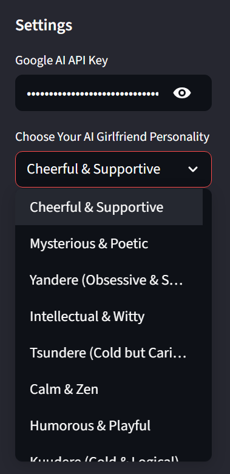
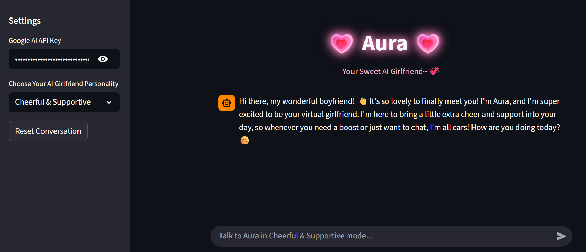

# 💗 Aura: AI Companion with Dynamic Personas


## 📌 Overview
**Aura** is an advanced conversational AI agent designed to simulate meaningful emotional connections. Built using **LangChain** and **Google's Gemini models**, Aura features a dynamic personality engine that allows users to interact with various character archetypes—from a cheerful supporter to complex personalities like Tsundere or Yandere.

Unlike simple LLM wrappers, Aura utilizes a **ReAct (Reason + Act) Agent** architecture. This enables her to maintain conversation context (Memory) and even access the internet (via DuckDuckGo) to provide up-to-date information while staying strictly in character.

## ✨ Key Features

### 🎭 Dynamic Personality Engine
Aura is not just a text generator; she embodies specific personas using advanced **Prompt Engineering**. Users can switch between personalities in real-time:
* **Cheerful & Supportive:** The ultimate hype-girl and optimist.
* **Intellectual & Witty:** Logical, deep, and playfully challenging.
* **Tsundere:** Cold and sarcastic on the outside, caring on the inside.
* **Yandere:** Obsessively sweet and possessive.
* **Kuudere:** Cool, logical, and seemingly emotionless.
* **Mysterious & Poetic:** Abstract, artistic, and cryptic.
* **Humorous & Playful:** Full of banter and jokes.

### 🧠 Intelligent Agent Architecture
* **Contextual Memory:** Uses `ConversationBufferMemory` to remember past interactions within the session, creating a fluid conversation flow.
* **Internet Access:** Integrated with `DuckDuckGoSearchRun`. If the user asks about current events or specific facts, Aura can browse the web to find the answer and paraphrase it according to her current personality.
* **ReAct Logic:** The agent uses "Thought-Action-Observation" loops to determine if she needs to use a tool (search) or just reply directly.

## 🛠️ Tech Stack
* **LLM Provider:** Google Generative AI (Gemini 2.5 Flash).
* **Orchestration:** LangChain (Agents, Executors, Prompts).
* **Frontend:** Streamlit (with custom CSS styling).
* **Search Tool:** DuckDuckGo Search API.

## 🚀 How It Works
The application uses a `create_react_agent` from LangChain. Here is the simplified flow:
1.  **User Input:** The user types a message.
2.  **Persona Injection:** The system injects a specific "System Prompt" based on the selected personality (e.g., *"You are a Yandere girlfriend..."*).
3.  **Reasoning:** The Agent decides if it needs external information.
    * *If yes:* It queries DuckDuckGo, gets the result, and rewrites it in the character's voice.
    * *If no:* It generates a response directly using the LLM.
4.  **Response:** The final output is displayed in the Streamlit UI.

## 📦 Installation & Usage

1.  **Clone the Repository**
    ```bash
    git clone [https://github.com/viochris/Simple-AI-Girlfriend.git](https://github.com/viochris/Simple-AI-Girlfriend.git)
    cd Simple-AI-Girlfriend
    ```

2.  **Install Dependencies**
    ```bash
    pip install streamlit langchain-google-genai langchain langchain-community duckduckgo-search
    ```

3.  **Run the Application**
    ```bash
    streamlit run ai_girlfriend.py
    ```

4.  **Setup**
    * Enter your **Google AI API Key** in the sidebar.
    * Select a personality.
    * Start chatting!

## 📷 Screenshots

### Dynamic Persona Selection
Users can choose from various personalities in the sidebar settings:


### Interactive Chat Interface
A glimpse of chatting with Aura in "Cheerful" mode:


---
**Author:** [Silvio Christian, Joe](https://github.com/viochris)
*"Code with heart, Data with soul."*
